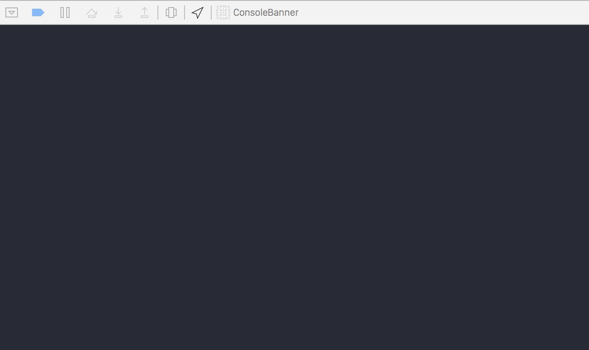

# ConsoleBanner

[](https://travis-ci.org/Brian Michel/ConsoleBanner)
[](http://cocoapods.org/pods/ConsoleBanner)
[](http://cocoapods.org/pods/ConsoleBanner)
[](http://cocoapods.org/pods/ConsoleBanner)

## What Is This?

Just wanted to make a small thing that could print out a sweet banner when a debugger was connected to an application.
You may see these kinds of banners in page sources, or when you connect to servers, so why not your app?

Basically, it just looks for a `banner.txt` file in the main bundle to print out in your console before printing
system information.

You can generate some sweet ASCII art here http://patorjk.com/software/taag/

Check it out...


## Usage

To run the example project, clone the repo, and run `pod install` from the Example directory first.

## Installation

ConsoleBanner is available through [CocoaPods](http://cocoapods.org). To install
it, simply add the following line to your Podfile:

```ruby
pod "ConsoleBanner"
```

## Author

Brian Michel, brian.michel@gmail.com

## License

ConsoleBanner is available under the MIT license. See the LICENSE file for more info.
